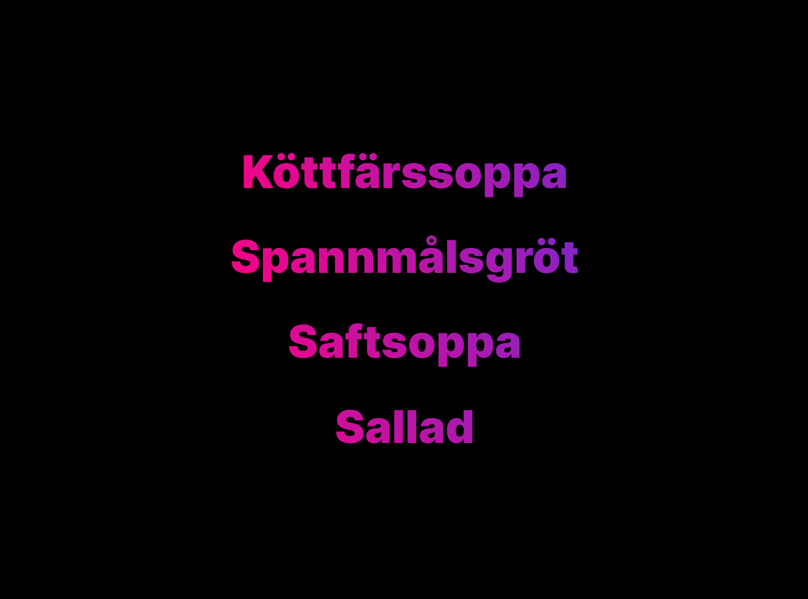

<a href="https://larkanscran.netlify.app">
  <p align="center">
    
  </p>
</a>

<p align="center">
  <strong>
    Check out Lärkan Gymnasiet's lunch menu today
  </strong>
</p>

<h3 align="center">
  <a href="#prerequisites">Prerequisites</a>
  <span> · </span>
  <a href="#getting-started">Getting Started</a>
  <span> · </span>
  <a href="#technologies">Technologies</a>
</h3>

<a href="https://larkanscran.netlify.app">
  <p align="center">
    
  </p>
</a>

## Prerequisites

- Node.js 12<

## Getting Started

```
# clone repo
git clone https://github.com/MaximilianHagelstam/larkanscran.git

# move into project
cd larkanscran
```

```
# Server

# move into folder
cd server

# install dependencies
npm install

# start server
npm run dev
```

```
# Client

# move into folder
cd client

# create .env
cp .env.example .env

# install dependencies
npm install

# run app
npm start
```

## Technologies

- Express.js
- React

## License

This project is licensed under the terms of the [MIT](https://choosealicense.com/licenses/mit/) license.
